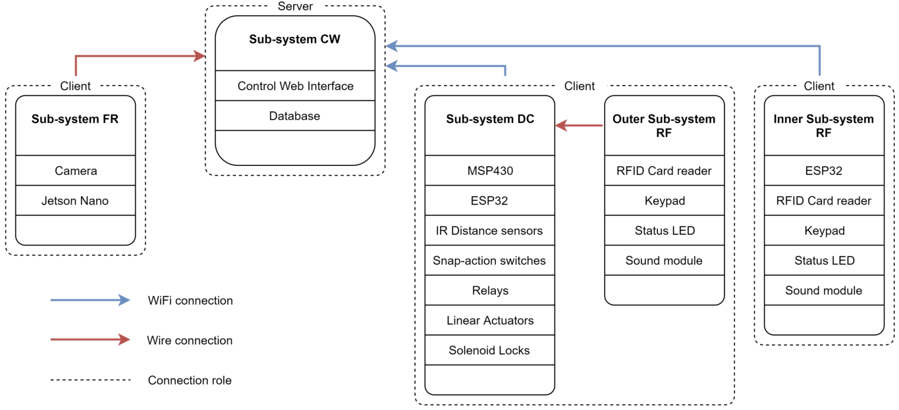

# 2-factor-access-control-system

On the occasion of completing a release of a task, this project is remembered, and this `README.md` is added. /:v

Hope it is useful in some way for you, who is comming across this.

## Problems-solutions analysis

## High-level system design

## More details
Read our poster [here](docs/poster.pdf), and thesis [here](docs/thesis_2_factor_access_control.pdf)

## Disclaimer
Please ignore if this thesis is somehow poorly scientifically-backed. Well, after 2 years, now looking back at it, a little bit ashamed when making it public. However, I feel grateful, for the past, and to my teammate-bro /:v

## End
